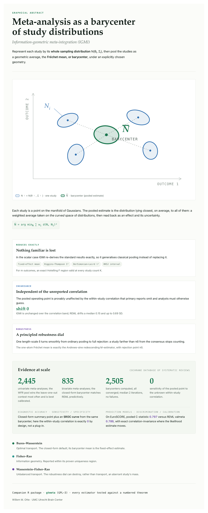

# gtmeta

`gtmeta` is an R package for information-geometric meta-analysis. It represents a study as an estimated Gaussian sampling distribution and pools studies with Bures-Wasserstein, Fisher-Rao, or Wasserstein-Fisher-Rao geometry. The package also contains classical FE, RE, and UWLS benchmarks, simulation helpers, theorem-anchored tests, and adapters for Cochrane-style extracted estimates.

The package is deliberately conservative: geometric estimators are checked against familiar meta-analytic limits where those limits exist. In the scalar fixed-variance case, the Bures-Wasserstein mean reduces to the fixed-effect estimator; the Frechet-variance calibration recovers standard heterogeneity quantities; and the Wasserstein-Fisher-Rao pool gives a robust redescending estimator with a transparent cutoff.

A worked tour of the package -- pooling, heterogeneity, inference, diagnostic accuracy, and robustness -- is in the vignette, also rendered as a standalone site at <https://wmotte.github.io/gtmeta/>. Rebuild it locally with `Rscript docs/build.R`.

<p align="center">
  
</p>

## Installation

```r
# install.packages("remotes")
remotes::install_github("wmotte/gtmeta")
```

For local development from this directory:

```sh
R CMD build .
R CMD check --no-manual gtmeta_0.1.0.tar.gz
```

The core package depends on base R and `metafor`. Optional comparators and bridge packages are in `Suggests`:

- `mvmeta`, `mada`, and `metamisc` for comparison models and diagnostic-accuracy benchmarks;
- `reticulate` for the optional Python/POT Wasserstein-Fisher-Rao bridge;
- `testthat` and `withr` for development tests.

## Quickstart

```r
library(gtmeta)

studies <- igmi_studies(
  yi  = c(0.42, 0.31, 0.55, 0.18, 0.40),
  sei = c(0.20, 0.18, 0.25, 0.15, 0.22)
)

fit <- bw_barycenter(studies, weights = igmi_precision_weights(studies))
fit$theta
fit$converged
```

Diagnostic test accuracy studies can be represented as bivariate Gaussian evidence on the logit sensitivity and logit specificity scale:

```r
dta <- igmi_dta_studies(
  tp = c(80, 62), fn = c(20, 18),
  fp = c(9, 12),  tn = c(91, 88)
)

dta_studies <- lapply(dta, function(s) igmi_gaussian(s$theta, s$Sigma))
bw_barycenter(dta_studies)$theta
```

## Repository layout

```text
.
├── DESCRIPTION
├── NAMESPACE
├── R/                  # package source
├── man/                # generated Rd documentation
├── tests/testthat/     # theorem-anchored unit tests
├── validate.R          # lightweight live numerical validation script
├── renv.lock           # local development dependency lockfile
└── .github/workflows/  # R CMD check workflow
```

## Validation

Run the unit tests through R CMD check:

```sh
R CMD build .
R CMD check --no-manual gtmeta_0.1.0.tar.gz
```

For a smaller smoke gate that sources the package code directly:

```sh
RENV_CONFIG_AUTOLOADER_ENABLED=false Rscript validate.R
```

Some checks that use real external corpora or optional Python optimal-transport tooling skip cleanly when those resources are unavailable.

## License

GPL-3. The full license text is in [LICENSE.md](LICENSE.md).
